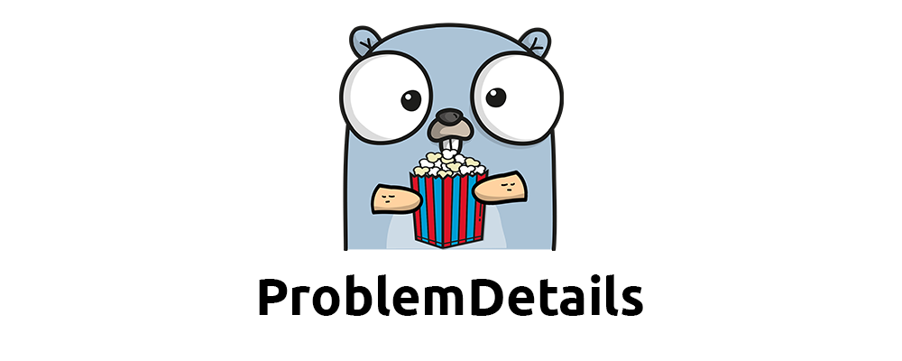

<div align="center" style="margin-bottom:20px">
  
  <div align="center">
    <a href="https://github.com/meysamhadeli/problem-details/actions/workflows/ci.yml"></a>
	  <a href="https://goreportcard.com/report/github.com/meysamhadeli/problem-details" ></a>
    <a></a>
    <a href="https://github.com/meysamhadeli/problem-details/blob/main/LICENSE"></a>
        <a href="https://coveralls.io/github/meysamhadeli/problem-details?branch=main"></a>
    <a href="https://pkg.go.dev/github.com/meysamhadeli/problem-details"></a>

  </div>
</div>

> ProblemDetails is a Error Handler base on [RFC 7807](https://datatracker.ietf.org/doc/html/rfc7807) standard to map our error to standardized error payload to client. The data model for problem details is a JSON object; when formatted as a JSON document, it uses the `application/problem+json` media type and for XML format it uses the `application/problem+xml` media type. By defining machine-readable details of HTTP errors, we can avoid defining new error response formats for HTTP APIs.

Our problem details response body and headers will be look like this:
```go
    // Response body

{
    "status": 400,                                        // The HTTP status code generated on the problem occurrence
    "title": "bad-request",                               // A short human-readable problem summary
    "detail": "We have a bad request in our endpoint",    // A human-readable explanation for what exactly happened
    "type": "https://httpstatuses.io/400",                // URI reference to identify the problem type
    "instance": "/sample1",                               // URI reference of the occurrence
    "stackTrace": "some more trace for error",            // More trace information error for what exactly happened
}
```
```go
    // Response headers

     content-type: application/problem+json
     date: Thu,29 Sep 2022 14:07:23 GMT 
```
There are some samples for using this package on top of Echo [here](./sample/cmd/echo/main.go) and for Gin [here](./sample/cmd/gin/main.go).

## Installation

```bash
go get github.com/meysamhadeli/problem-details
```

## Web-Frameworks

> ### Echo

#### Error Handler:
For handling our error we need to specify an `Error Handler` on top of `Echo` framework:
```go
// EchoErrorHandler middleware for handle problem details error on echo
func EchoErrorHandler(error error, c echo.Context) {

        // add custom map problem details here...

	// resolve problem details error from response in echo
	if !c.Response().Committed {
		if _, err := problem.ResolveProblemDetails(c.Response(), c.Request(), error); err != nil {
			log.Error(err)
		}
	}
}
```

#### Map Status Code Error:

In this sample we map status code `StatusBadGateway` to `StatusUnauthorized` base on handler config to problem details error.
 
 ```go
// handle specific status code to problem details error
func sample1(c echo.Context) error {
        err := errors.New("We have a specific status code error in our endpoint")
	    return echo.NewHTTPError(http.StatusBadGateway, err)
}
 ```
 ```go
// problem details handler config
problem.MapStatus(http.StatusBadGateway, func() problem.ProblemDetailErr {
        return &problem.ProblemDetail{
            Status: http.StatusUnauthorized,
            Title:  "unauthorized",
            Detail: error.Error(),
        }
})
 ```
#### Map Custom Type Error:

In this sample we map custom error type to problem details error. 

```go
// handle custom type error to problem details error
func sample2(c echo.Context) error {
        err := errors.New("We have a custom type error in our endpoint")
	return custom_errors.BadRequestError{InternalError: err}
}
```
 ```go
// problem details handler config
problem.Map[custom_errors.BadRequestError](func() problem.ProblemDetailErr {
        return &problem.ProblemDetail{
            Status: http.StatusBadRequest,
            Title:  "bad request",
            Detail: error.Error(),
        }
})
 ```

> ### Gin
#### Error Handler:
For handling our error we need to specify an `Error Handler` on top of `Gin` framework:
```go
// GinErrorHandler middleware for handle problem details error on gin
func GinErrorHandler() gin.HandlerFunc {
	return func(c *gin.Context) {

		c.Next()

		for _, err := range c.Errors {

                        // add custom map problem details here...
			
			if _, err := problem.ResolveProblemDetails(c.Writer, c.Request, err); err != nil {
				log.Error(err)
			}
		}
	}
}
```

#### Map Status Code Error:

In this sample we map status code `StatusBadGateway` to `StatusUnauthorized` base on handler config to problem details error.
 
 ```go
// handle specific status code to problem details error
func sample1(c *gin.Context) {
        err := errors.New("We have a specific status code error in our endpoint")
	    _ = c.AbortWithError(http.StatusBadGateway, err)
}
 ```
```go
// problem details handler config
problem.MapStatus(http.StatusBadGateway, func() problem.ProblemDetailErr {
        return &problem.ProblemDetail{
            Status: http.StatusUnauthorized,
            Title:  "unauthorized",
            Detail: err.Error(),
        }
})
```
#### Map Custom Type Error:

In this sample we map custom error type to problem details error. 

```go
// handle custom type error to problem details error
func sample2(c *gin.Context) {
        err := errors.New("We have a custom type error in our endpoint")
	customBadRequestError := custom_errors.BadRequestError{InternalError: err}
	_ = c.Error(customBadRequestError)
}
```
 ```go
// problem details handler config
problem.Map[custom_errors.BadRequestError](func() problem.ProblemDetailErr {
        return &problem.ProblemDetail{
            Status: http.StatusBadRequest,
            Title:  "bad request",
            Detail: err.Error(),
        }
})
 ```

> ### Custom Problem Details:

We support custom problem details error for create more flexibility response error:
```go
// custom problem details
type CustomProblemDetail struct {
            problem.ProblemDetailErr
	    Description    string `json:"description,omitempty"`
	    AdditionalInfo string `json:"additionalInfo,omitempty"`
}
```
 ```go
// problem details handler config
problem.Map[custom_errors.ConflictError](func() problem.ProblemDetailErr {
        return &custom_problems.CustomProblemDetail{
            ProblemDetailErr: &problem.ProblemDetail{
                Status: http.StatusConflict,
                Title:  "conflict",
                Detail: error.Error(),
            },
            AdditionalInfo: "some additional info...",
            Description:    "some description...",
        }
})
 ```

# Support

If you like my work, feel free to:

- ⭐ this repository. And we will be happy together :)

Thanks a bunch for supporting me!

## Contribution

Thanks to all [contributors](https://github.com/meysamhadeli/problem-details/graphs/contributors), you're awesome and this wouldn't be possible without you! The goal is to build a categorized community-driven collection of very well-known resources.

Please follow this [contribution guideline](./CONTRIBUTION.md) to submit a pull request or create the issue.
